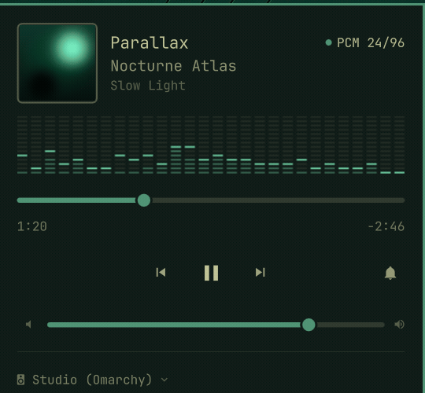
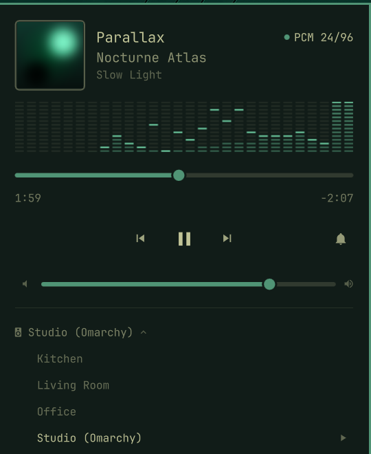
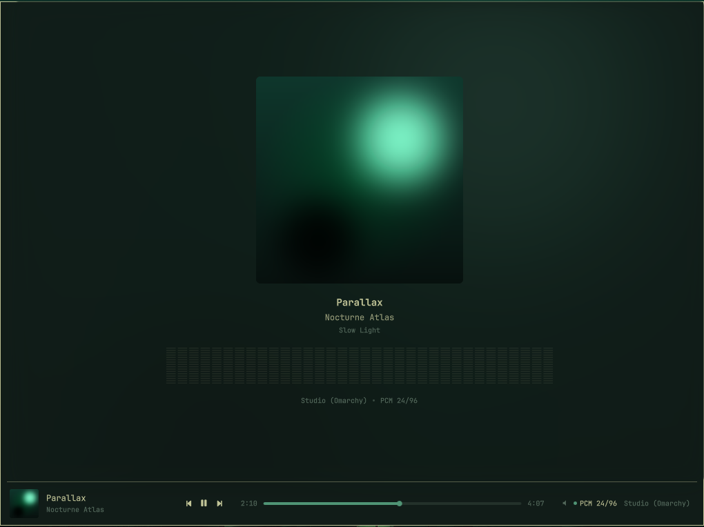
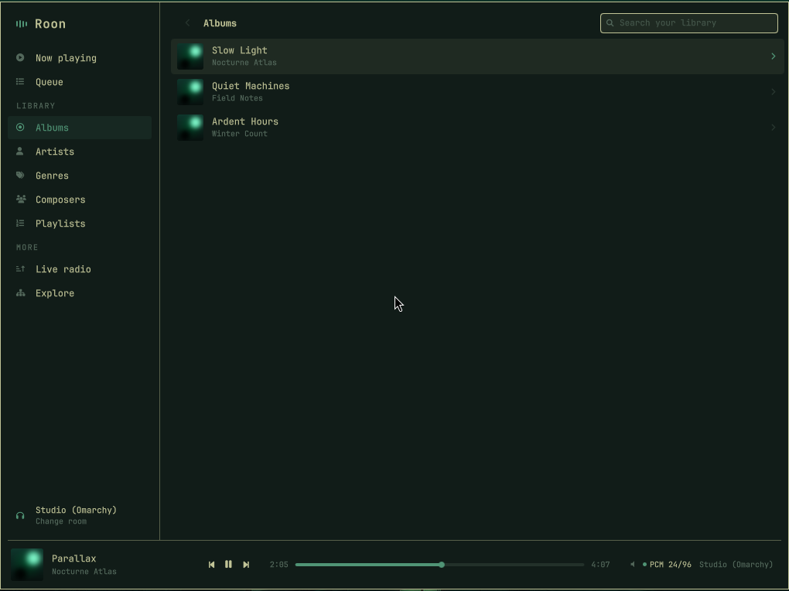
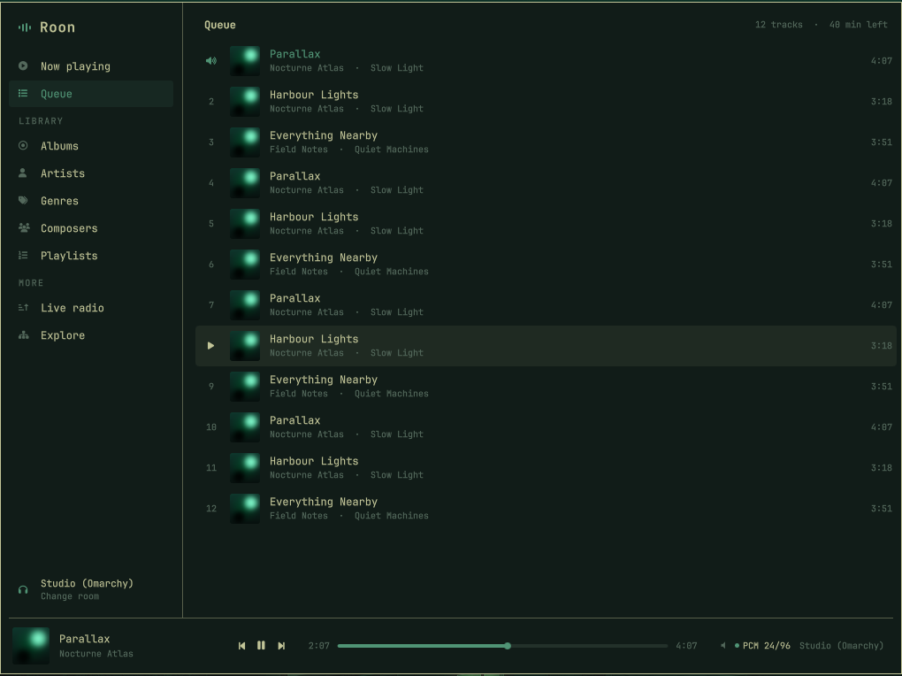

# Roon for Omarchy

**Your Omarchy machine, as a Roon endpoint — with the zone in your bar.**
Play to this desktop from the Roon app on your phone, and see what it is playing
without a window anywhere.



*Screenshots and the animation above are taken in demo mode against invented
zones and a generated sleeve. Nothing personal was ever written to the files.*

---

## What this is

Roon ships no client for Linux. There is a headless server and a headless
bridge, and that is all — every remote is Windows, macOS, iOS or Android. The
most popular workaround on the AUR runs the **Windows app under Proton**, which
is a fair measure of how much people want this.

This takes the other path. A small daemon holds the connection to your Core and
publishes it to the desktop; the bar shows what is playing and lets you drive it.
There is no window, no Electron, and no browser engine.

**The endpoint, the bar, and a summoned player.** Now playing, your library,
search and the queue — driven from this machine or from the Roon app on your
phone, whichever is nearer.

## Requirements

> **A Roon subscription and a Roon Core on your network are required.** This is a
> client and an endpoint, not a source of music.

- **Omarchy 4+** with Quickshell
- **PipeWire**, with `pipewire-alsa`
- `python-gobject` — for MPRIS and the artwork palette
- `cava`, if you want the spectrum analyser
- A Roon Core reachable on the LAN

## Install

```bash
omarchy plugin add https://github.com/ph0bos/omarchy-roon-client.git
omarchy plugin enable quickshell.roon
```

Then set up the endpoint and the daemon:

```bash
./bin/omarchy-roon-endpoint install     # RoonBridge, as you, under a --user unit
./bin/omarchy-roon-endpoint firewall    # the ports RAAT actually needs
./bin/omarchy-roon-endpoint daemon      # the Roon connection, the API and MPRIS
./bin/omarchy-roon-endpoint doctor      # what is true right now
```

Approve the extension once in **Roon → Settings → Extensions** (from your phone;
there is no Roon GUI on Linux), enable this machine's output under
**Settings → Audio**, then:

```bash
./bin/omarchy-roon-endpoint pipewire    # route that output through PipeWire
```

`doctor` is read-only and is the first thing to run when anything looks wrong.

### Removal

```bash
./bin/omarchy-roon-endpoint uninstall    # stops and removes both --user units
omarchy plugin disable quickshell.roon
omarchy plugin remove quickshell.roon
```

`uninstall` removes only what this project created: the two systemd `--user`
units. It deliberately leaves `aur/roonbridge` and `~/.local/share/omarchy-roon`
alone, because the package is Roon's own software and the data directory holds
your endpoint's identity — remove those yourself if you want them gone:

```bash
sudo pacman -Rns roonbridge
rm -rf ~/.local/share/omarchy-roon ~/.cache/omarchy-roon
sudo ufw delete allow 9200/tcp && sudo ufw delete allow 30000:65535/tcp \
  && sudo ufw delete allow 30000:65535/udp
```

The extension can also be removed from the Core in **Roon → Settings →
Extensions**. Nothing outside those paths is touched, and the one file this
project rewrites that it did not create — RAATServer's device JSON, when routing
through PipeWire — is backed up beside itself as `.bak` first.

## The bar


A level meter that moves while audio is playing, sits still when it is not, and
is struck through when the daemon is down. Click for the mini player; scroll to
skip.



The mini player carries the sleeve, a live spectrum analyser, the timeline,
transport, volume with mute, and the zone at the foot. The timeline, the volume
fill and the analyser are **lit in the artwork's own colour** — measured from the
sleeve, and falling back to your theme when a cover is genuinely monochrome.

Beside the title is what is **actually coming out of this machine** — `PCM 24/96`,
`DSD64` — with the dot lit in the record's colour above CD quality. It is read
from RAATServer, so it is the format the Core is really sending this endpoint,
not a guess.

Keys, if you want them, in `~/.config/hypr/bindings.lua`:

```lua
o.bind("SUPER + R",         "Roon",            "omarchy-shell roon overlay")
o.bind("SUPER + ALT + R",   "Roon queue",      "omarchy-shell roon queue")
o.bind("SUPER + SHIFT + R", "Roon play/pause", "omarchy-shell roon playpause")
```

`omarchy-shell roon status|zone|next|previous|notifications|refresh` are there
too, and `omarchy-shell roon player` opens the bar's mini player rather than the
full window.

## The player

A summoned window, over whatever you are working in, on the screen you are
looking at. Escape closes it; it remembers where you were.

Down the left is your library — Albums, Artists, Genres, Composers, Playlists,
Live radio — and each one is a place Roon can open directly rather than a folder
you have to walk to. The room you are playing to sits at the foot of it, because
everything above it follows that room. `Tab` moves between the sidebar and the
page.

**Now playing** — takes the whole window: the sidebar slides away and the record
gets the room. The sleeve leans toward your cursor with the light following it,
the page is washed in the record's own colour — measured from the artwork and
lifted until it can actually be read against your theme — and a live spectrum
analyser reads the same PipeWire signal that reaches your DAC, in that same
colour. The format leaving this machine sits underneath. Click the artwork in
the transport strip to leave, and you land back exactly where you were.



**The library** — anything in the sidebar, or `L`. Browse your Roon library, or
search it: results come back as Roon's own — a top hit, then artists, albums,
composers, tracks and works. `Enter` opens a row, `Backspace` goes back, and a
wall of covers is drawn as a grid while a track list stays a list.

An artist page is what you get by opening an artist, because in Roon that is
literally what an artist page is: a position in a server-driven tree, not an
object with an address.



**The queue** — what is coming next in the pinned room, with the count and the
time left. Click any row to play from there; everything after it stays. Roon's
own `play_from_here`, so it behaves exactly as it does on your phone.



The transport strip is shared by all three, because the controls should not
disappear because you switched to the queue.

The room at the foot of the sidebar, or `M`, opens the menu — shuffle, repeat,
Roon Radio, track notifications, and the rooms. Those first three are properties of the **zone**, so changing one changes
it for the room and for whoever is looking at their phone. Switching rooms here
switches everything: the bar, the media keys and the queue all follow the same
pinned zone. `?` shows the keyboard map.

```bash
omarchy-shell roon overlay          # now playing
omarchy-shell roon library          # straight to the library
omarchy-shell roon queue            # straight to the queue
```

Inside: `Space` play/pause, `←`/`→` previous and next, `Tab` sidebar, `N` now
playing, `L` library, `Q` queue, `/` search, `M` menu, `?` keys, `Escape` to
close.

### First run

If anything between this machine and sound in the room is missing, the window
opens on a five-step ladder instead of the player: Core found, paired, approved
in Roon, RoonBridge running, this machine visible as a zone. Each step says what
to do about itself, and the one you are stuck on is the one that is expanded.

The step people get stuck on is approval, and it is not a failure: an unapproved
extension does not error, it simply never answers. **Roon ships no interface for
Linux**, so enabling "Roon for Omarchy" under Settings → Extensions has to happen
on a phone or another computer. The wizard polls while you do it and moves on by
itself.

`omarchy-roon-endpoint doctor` is the same ladder in a terminal, plus the audio
and firewall checks. It is read-only.

## How it works

```
Roon app (phone)  ──▶  Roon Core  ──RAAT──▶  RoonBridge  ──▶  PipeWire  ──▶  DAC
                            │                                      │
                            └── MOO/WS ──▶ omarchy-roond ──▶ MPRIS ─┘
                                                 │
                                          HTTP + WS ──▶ bar + player
```

**The daemon owns the one thing QML cannot do**: discovery is UDP, pairing needs
a stored token, and zone state arrives as pushes on a subscription that has to
stay open. It is stdlib-only Python with no runtime dependencies.

**The bar reads MPRIS, not the socket.** Quickshell ships no WebSocket module, and
it does not need one: track, artwork and play state arrive push-based over D-Bus
for free. HTTP is used only for what MPRIS has no vocabulary for — which zone this
is, what others exist, and mute.

**Album art never touches the daemon.** The Core serves it over plain HTTP, so QML
points `Image` straight at the Core and Qt's own cache does the work.

**Playback is gapless, and none of that is this client's doing.** RAAT streams
continuously and the Core drives it; consecutive tracks at the same format play
through without the sound card being reconfigured. Measured on a real session:
64 stream starts against 9 device setups, and every setup lined up with a format
change rather than a track change. A change of rate or depth *does* reconfigure
the device, which is a real gap — that is what Roon's resync delay setting is for.

**RoonBridge runs as you, not root.** The packaged unit is `User=root`, and root
cannot reach your PipeWire session — so a root bridge can only take the sound card
exclusively, silencing system audio. Running it as you, through `plug:pipewire`,
is also what makes the spectrum analyser possible at all: it taps the same signal
that reaches your DAC.

## Known constraints

These are Roon's, not this client's, and they are worth knowing before you file
a bug:

- **No format data over the API** — but the badge works anyway. Roon's *extension*
  API exposes no sample rate, bit depth or signal path at all. This machine is the
  endpoint though, so RAATServer is told exactly what to play and writes it down;
  the badge reads that. It therefore appears only when the pinned zone is **this**
  machine — another room is played by hardware this one knows nothing about.
- **No file format, ever.** FLAC, ALAC and AAC never reach an endpoint: **RAAT
  decodes on the Core and streams PCM.** The setup request carries sample type,
  rate, depth and channels and nothing else, which is why the badge says `PCM
  24/96` — the same thing Roon's own signal path says at this stage.
- **No track identifiers.** `now_playing` is three pre-formatted display strings
  and an image key. Everything downstream parses those.
- **No favouriting.** It lives in Roon's browse action lists, which are not
  reachable from what is playing.
- **An artist page is a position, not an object.** There is no metadata API to
  fetch one from, so opening an artist walks the browse tree to where their
  albums are. It works, and it is why there is no way to link to one.
- **One queue at a time.** The daemon holds a single queue subscription, and it
  follows the pinned zone. Pin another room to see its queue.
- **Discovery is fragile.** Omarchy's default firewall drops the reply, and a Core
  in a bridge-networked container never sees the broadcast at all. There are three
  discovery tiers for this reason, and `doctor` will tell you which one is in play.

## Development

```bash
pytest                                   # 86 tests, no Core required
python -m omarchy_roond --serve --demo   # synthetic zones, invented music
python -m omarchy_roond --browse         # exercise a real Core from the terminal
ROON_LIVE_HOST=<core-ip> pytest tests/test_live.py
```

`--demo` exists so the interface can be built, and photographed, without a
subscription and without putting anyone's hostname or listening history in a file.

`spikes/` holds the throwaway programs that worked the protocol out, and
`spikes/fixtures/` the payloads captured from a real Core that the tests run
against.

## Not affiliated with Roon Labs

Roon is a trademark of Roon Labs LLC. This is an independent client that talks to
Roon's public extension API; it is not endorsed by, affiliated with, or supported
by Roon Labs. **RoonBridge is Roon's own software** and is installed from the AUR,
not distributed here.

## Licence

MIT — see [LICENSE](LICENSE).
